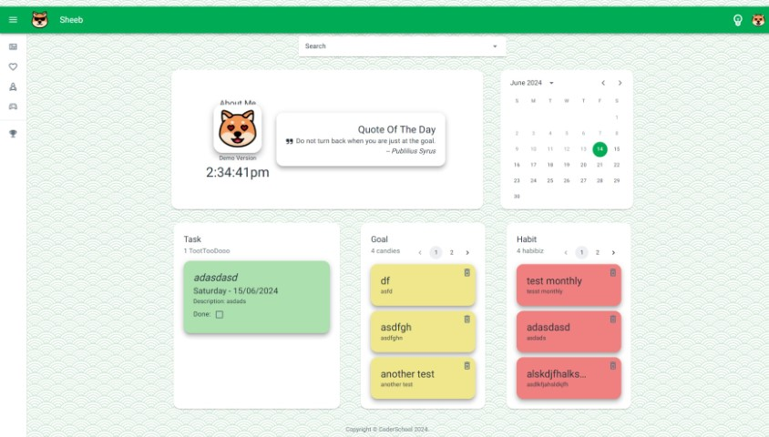
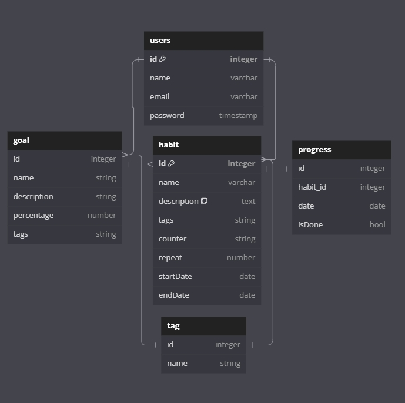

<a id="top"></a>

<p align="center">
  <a href="https://github.com/blueleorio/FullStackFinalProject">
    
  </a>
</p>
<p align="center">
  <a href="https://github.com/blueleorio/FullStackFinalProject">
    
  </a>
</p>
<p align="center">
  
</p>

<p align="center">
  
  
  
  
</p>

---

# ⚡️ Table of Contents

<details>
<summary>Click to expand</summary>

1. [Project Introduction](#project-introduction)
2. [Installation](#installation)
3. [Usage](#usage)
4. [User Stories](#user-stories)
5. [Schema & ERD](#schema)
6. [API](#api)
7. [Todo list](#todo)

</details>

<a id="project-introduction"></a>

# ⭐️ Introduction

#### Hello, this is Sheeb. I made it for my final project in the Full Stack Developer course at CoderSchool. I use habit trackers every day and wanted to make one that is fun and helpful

#### With Sheeb, you can keep track of your habits, stay excited, and enjoy reaching your goals. It's not just a habit tracker, it's a tool to help you get better every day

# 🏆 Features

- **Habit Maker**: Create your desired tasks with a variety of scheduling options
- **Goal Tracker**: Keep track of your habit progress effectively
- **Self-hosted, Open-source**: Customize to your heart's content

# :tv: Demo

### Status: (Click to proceed to webpage)


### Log In Page


### Dash Board Page



<a id="installation"></a>
<p align="right"><a href="#top">Go to top ↾</a></p>

# :file_folder: Installation

## Prerequisites

Here's what you need to be able to run Sheeb:

- Node.js (version >= 18)
- MongoDB Database

### 1. Clone the repository

```sh
git clone  https://github.com/blueleorio/FullStackFinalProject.git
```

<details>
<summary>Tree Directory</summary>

# :deciduous_tree::deciduous_tree::deciduous_tree:

```
.root                 .root
├── client            ├── server
│ ├── src             │ ├── controllers
│ │ ├── app           │ ├── helpers
│ │ ├── components    │ ├── middlewares
│ │ ├── contexts      │ ├── models
│ │ ├── features      │ ├── routes
│ │ ├── hooks         │ │
│ │ ├── layouts       │ ├── .env
│ │ ├── pages         │ └── app.js
│ │ ├── routes        │
│ │ ├── themes        └── README.md       
│ │ ├── utils
│ │ └── App.js
│ ├── .env
│ └── README.md
```

</details>

### 2. Install dependencies

## Client

<details>
<summary> Expand for more</summary>

```sh
cd client
npm install
```

### .env

```sh
REACT_APP_BACKEND_API = your back-end port
REACT_APP_GOOGLE_CLIENT_ID = "your_code_id.apps.googleusercontent.com"
REACT_APP_CLOUDINARY_CLOUD_NAME = your cloud name
REACT_APP_CLOUDINARY_UPLOAD_PRESET = your preset
```

</details>

## Server

<details>
<summary> Expand for more</summary>

```sh
cd server
npm install
```

### .env

```sh
PORT = 8000
MONGODB_URI =mongodb://localhost:27017/...
JWT_SECRET_KEY = "your jwt secret key"
GOOGLE_CLIENT_ID = "your_code_id.apps.googleusercontent.com"
```

</details>

### 3. Initialize the app

## Client

```sh
npm start
```

## Server

```sh
npm run dev
```

<p align="right"><a href="#top">Go to top ↾</a></p>
<a id="user-stories"></a>

# :bell: User Stories

### Authentication

1. As a user, I want to sign up/ log in using email.
2. As a user, I want to sign up/ log in using Google Authentication Service.

### User

1. As a user, I want to custom my profile account with extra information.
2. As a user, I want to add my own profile picture.
3. As a user, I want to have a short introduction about myself.

### Habit

1. As a user, I want to create habit with options such as: daily/weekly/yearly options.
2. As a user, I want to edit my habit fields such as: title and description.
3. As a user, I want to delete my habit.
4. As a user, I want to click on the habit to see more information.
5. As a user, I want to add tag(s) when I create new habit.
6. As a user, I want to search Habit.

### Goal

1. As a user, I want to create goal with selected habit.
2. As a user, I want to track my goal with start date and end date.
3. As a user, I want to edit my goal fields such as: title and description.
4. As a user, I want to delete my goal.
5. As a user, I want to click on the goal to see more information.
6. As a user, I want to add tag(s) when I create new goal.
7. As a user, I want to see my streak with total progresses, progress done, and done percentage.
8. As a user, I want to search Goal

### Tag

1. As a user, I want to create tag and assign tag to habit and goal.
2. As a user, I want to delete tag.
3. As a user, I want to filter habit and goal based on selected Tag.

### Progress

1. As a user, I want to click Done to finish my progress on that day.
2. As a user, I want to click any on day in Calendar to see habit for that particular day.

### Quality of life

1. As a user, I want to see Famous quote, time, calendar... on homepage dashboard.

---
<p align="right"><a href="#top">Go to top ↾</a></p>

<a id="schema"></a>

# :triangular_ruler: Schema & ERD

### Entity Relationship Diagram



### Schema

<details>
<summary>User Model :</summary>

```js
const userSchema = new mongoose.Schema(
     {
    name: {
      type: String,
      required: true,
    },
    password: {
      type: String,
      required: true,
      select: false,
    },
    email: {
      type: String,
      required: true,
      unique: true,
    },
    phoneNumber: {
      type: String,
      default: "",
    },
    avatarUrl: {
      type: String,
      default: "",
    },
    aboutMe: {
      type: String,
      default: "",
    },
    address: {
      type: String,
      default: "",
    },
    city: {
      type: String,
      default: "",
    },
    country: {
      type: String,
      default: "",
    },
    habits: [
      {
        type: mongoose.Schema.Types.ObjectId,
        ref: "Habit",
        default: [],
      },
    ],
    goals: [
      {
        type: mongoose.Schema.Types.ObjectId,
        ref: "Goal",
        default: [],
      },
    ],
    providers: {
      type: String,
      enum: ["local", "google"],
      default: "local",
    },
    isDeleted: {
      type: Boolean,
      default: false,
      select: false,
    },
  },
  {
    timestamps: true,
  }
);
```

</details>

<details>
<summary>Habit Model:</summary>

```js
const habitSchema = mongoose.Schema({
     name: {
      type: String,
      required: true,
    },
    description: {
      type: String,
      default: "",
    },
    startDate: {
      type: Date,
      required: true,
    },
    endDate: {
      type: Date,
      required: true,
    },
    reminder: {
      type: [String],
      enum: [
        "Monday",
        "Tuesday",
        "Wednesday",
        "Thursday",
        "Friday",
        "Saturday",
        "Sunday",
      ],
      default: [],
    },
    counter: {
      type: String,
      enum: ["weekly", "monthly", "yearly"],
      default: "weekly",
    },
    repeat: {
      type: Number,
      default: 1,
    },
    createdBy: {
      type: mongoose.Schema.Types.ObjectId,
      ref: "User",
      required: true,
    },
    tags: {
      type: [{ type: mongoose.Schema.Types.ObjectId, ref: "Tag" }],
      default: [],
    },

    status: {
      type: Boolean,
      default: false,
    },
    deletedAt: Date,
    isDeleted: {
      type: Boolean,
      default: false,
      select: false,
    },
  },

  {
    timestamps: true,
  }
);
```

</details>

<details>
<summary>Goal Model:</summary>

```js
const goalSchema = mongoose.Schema(
  {
   name: {
      type: String,
      required: true,
    },
    description: {
      type: String,
    },
    startDate: {
      type: Date,
      required: true,
    },
    endDate: {
      type: Date,
      required: true,
    },
    counter: {
      type: String,
      enum: ["weekly", "monthly", "yearly"],
      default: "weekly",
    },
    repeat: {
      type: Number,
      default: 1,
    },
    habitId: {
      type: mongoose.Schema.Types.ObjectId,
      ref: "Habit",
      // required: true,
    },
    createdBy: {
      type: mongoose.Schema.Types.ObjectId,
      ref: "User",
      required: true,
    },
    progress: {
      type: [{ type: mongoose.Schema.Types.ObjectId, ref: "Progress" }],
      default: [],
    },
    percentage: {
      type: Number,
      default: 0,
      min: 0,
      max: 100,
    },
    tags: {
      type: [{ type: mongoose.Schema.Types.ObjectId, ref: "Tag" }],
      default: [],
    },
    deletedAt: Date,
    isDeleted: {
      type: Boolean,
      default: false,
      select: false,
    },
  },
  {
    timestamps: true,
  }
);

```

</details>

<details>
<summary>Tag Model:</summary>

```js
const tagSchema = mongoose.Schema(
  {
    name: {
      type: String,
      required: true,
      unique: true,
      trim: true,
      maxlength: 20,
      lowercase: true,
    },

    deletedAt: Date,
  },
  {
    timestamps: true,
  }
);
```

</details>

<details>
<summary>Progress Model:</summary>

```js
const progressSchema = mongoose.Schema(
  {
    date: {
      type: Date,
      required: true,
    },
    isDone: {
      type: Boolean,
      default: false, //! incomplete
    },
    habitId: {
      type: mongoose.Schema.Types.ObjectId,
      ref: "Habit",
    },
    createdBy: {
      type: mongoose.Schema.Types.ObjectId,
      ref: "User",
    },
    deletedAt: Date,
    isDeleted: {
      type: Boolean,
      default: false,
      select: false,
    },
  },
  {
    timestamps: true,
  }
);

```

</details>
<p align="right"><a href="#top">Go to top ↾</a></p>
<a id="api"></a>

# :key: BackEnd API

### URL: <https://fullstackfinalproject.onrender.com/>

### API Endpoint

### :egg: User /users

<details>
<summary>Current User Information:</summary>

```
/**
 * @route GET /User/me
 * @description Retrieves information about the currently authenticated user.
 * @access Login required
 */

 GET URL/User/me
```

</details>

<details>
<summary>Update User Information:</summary>

```
/**
 * @route PUT /User/:id
 * @description Update user profile
 * @access Login required
 * @req 
  [
    "email",
    "name",
    "aboutMe",
    "address",
    "city",
    "country",
    "phoneNumber",
    "avatarUrl",
  ]
 */

 PUT URL/User/:id
```

</details>

### :egg: Habit /habits

<details>
<summary>Get Habit List:</summary>

```
/**
 * @route GET /Habits/user/:userId
 * @description get list of Habits
 * @access Login required
 */

 GET URL/Habits/user/:userdId
```

</details>

<details>
<summary>Search Habit based on name:</summary>

```
/**
 * @route GET /habits/search?name=:name
 * @description get list of goal based on name
 * @access Login required
 */

 GET URL/Habits/search?name=:name
```

</details>

<details>
<summary>Update Habit:</summary>

```
/**
 * @route PUT /Habits/:habitId
 * @description update a Habit
 * @access Login required
 * @req ["name", "description"]
 */

 PUT URL/Habits/:habitId
```

</details>

<details>
<summary>Delete Habit:</summary>

```
/**
 * @route DELETE /Habits/:habitId
 * @description delete a Habit
 * @access Login required
 */

 DELETE URL/Habits/:habitId
```

</details>

<details>
<summary>Get habit by date:</summary>

```
/**
 * @route GET /Habits/date/:date
 * @description get list of Habits for a specific date
 * @access Login required
 */

 GET URL/Habits/date/:date
```

</details>

### :egg: Goal /goals

<details>
<summary>Get Goal list:</summary>

```
/**
 * @route GET /goals/user/:userId
 * @description get list of Goals of user
 * @access Login required
 */

 GET URL/goals/user/:userId
```

</details>

<details>
<summary>Get Goal based on name:</summary>

```
/**
 * @route GET /goals/search?name=:name
 * @description get list of goal based on name
 * @access Login required
 */

 GET URL/goals/search?name=:name
```

</details>

<details>
<summary>Delete Goal:</summary>

```
/**
 * @route DELETE /Goals/:goalId
 * @description delete a Goal
 * @access public
 */

 DELETE URL/goals/:goalId
```

</details>

### :egg: Progress /progresses

<details>
<summary>get Progress on date:</summary>

```
/**
 * @route GET /Progresses/:ProgId
 * @description get current Prog for current selected date
 * @access Login required
 */

 GET URL/progresses/:ProgId
```

</details>

</details>

### :egg: Tag /tags

<details>
<summary>create Tag:</summary>

```
/**
 * @route POST /tags
 * @description create a tag
 * @access Login required
 * @req { "name"}
 */

 POST URL/tags/
```

</details>

<details>
<summary>get Tag list:</summary>

```
/**
 * @route GET /tags
 * @description get list of tags
 * @access Login required
 */

 GET URL/tags/
```

</details>

</details>

<details>
<summary>delete Tag:</summary>

```
/**
 * @route DELETE /tags/:tagId
 * @description delete a tag
 * @access Login required
 */

 DELETE URL/tags/:tagId
```

</details>

<p align="right"><a href="#top">Go to top ↾</a></p>

---

<a id="todo"></a>

# :lollipop: Things To Do

- [ ] Make documents clean
  - Check all writings are correct and show what we do now.
  - Take out old or not needed writings.

- [ ] Make code better
  - Find parts of the writing in code that can be easier or better.
  - Use easy ways to write code that others can understand.

- [ ] Fix logic
  - Look at how the app decides things and make it better or faster.
  - Change parts to make the app work better for users.

- [ ] Make the look nicer
  - Make the app look better and easy to use.
  - Keep the design the same all through the app.

- [ ] Handle mistakes well
  - Make sure the app can find and tell about mistakes in a way users can understand.

- [ ] Keep the app safe
  - Check and make the app more secure.
  - Use good ways to protect information and access.

- [ ] Make the app faster
  - Find ways to make the app work faster.
  - Use less power and open pages quickly.

- [ ] Test more
  - Do more checks to make sure everything works.
  - Use tests to find problems before users do.

- [ ] Update tools
  - Look for new versions of tools and use them.
  - Make sure new tools work well with the app.

<p align="right"><a href="#top">Go to top ↾</a></p>

<!-- Repository -->
