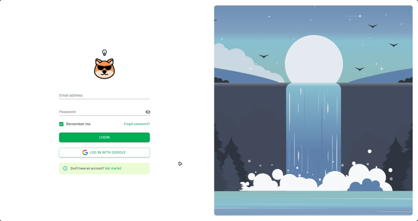

<a id="top"></a>

<p align="center">
  <a href="https://github.com/blueleorio/FullStackFinalProject">
    
  </a>
</p>
<p align="center">
  <a href="https://github.com/blueleorio/FullStackFinalProject">
    
  </a>
</p>
<p align="center">
  
  
</p>
<p align="center">
  
  
  
  
</p>

---

# ⚡️ Table of Contents

<details>
<summary>Click to expand</summary>

1. [Project Introduction](#project-introduction)
2. [Installation](#installation)
3. [Usage](#usage)
4. [Contributing](#contributing)
5. [License](#license)
</details>

<a id="project-introduction"></a>

# ⭐️ Introduction

#### Hello, this is Sheeb. I made it for my final project in the Full Stack Developer course at CoderSchool. I use habit trackers every day and wanted to make one that is fun and helpful.

#### With Sheeb, you can keep track of your habits, stay excited, and enjoy reaching your goals. It's not just a habit tracker, it's a tool to help you get better every day.

# 🏆 Features

- **Habit Maker**: Create your desired tasks with a variety of scheduling options
- **Goal Tracker**: Keep track of your habit progress effectively
- **Analytics**: Gain insights through visual analytics
- **Self-hosted, Open-source**: Customize to your heart's content

# :tv: Demo



# :file_folder: Installation

## Prerequisites

Here's what you need to be able to run Sheeb:

- Node.js (version >= 18)
- MongoDB Database

### 1. Clone the repository

```sh
git clone  https://github.com/blueleorio/FullStackFinalProject.git
```

<details>
<summary>Tree</summary>

# :deciduous_tree::deciduous_tree::deciduous_tree:

```
.root
├── client
│ ├── src
│ │ ├── app
│ │ ├── components
│ │ ├── contexts
│ │ ├── features
│ │ ├── hooks
│ │ ├── layouts
│ │ ├── pages
│ │ ├── routes
│ │ ├── themes
│ │ ├── utils
│ │ └── App.js
│ ├── .env
│ └── README.md
│
├── server
│ ├── controllers
│ ├── helpers
│ ├── middlewares
│ ├── models
│ ├── routes
│ │
│ ├── .env
│ └── app.js
│
└── README.md

```

</details>

### 2. Install dependencies

## Client

<details>
<summary> Expand for more</summary>

```sh
cd client
npm install
```

### .env

```sh
REACT_APP_BACKEND_API = your back-end port
REACT_APP_GOOGLE_CLIENT_ID = "your_code_id.apps.googleusercontent.com"
REACT_APP_CLOUDINARY_CLOUD_NAME = your cloud name
REACT_APP_CLOUDINARY_UPLOAD_PRESET = your preset
```

</details>

## Server

<details>
<summary> Expand for more</summary>

```sh
cd server
npm install
```

### .env

```sh
PORT = 8000
MONGODB_URI =mongodb://localhost:27017/...
JWT_SECRET_KEY = "your jwt secret key"
GOOGLE_CLIENT_ID = "your_code_id.apps.googleusercontent.com"
```

</details>

### 3. Initialize the app

## Client

```sh
npm start
```

## Server

```sh
npm run dev
```

# :bell: User Stories

### Authentication

1. As a user, I want to sign up/ log in using email
2. As a user, I want to sign up/ log in using Google Authentication Service

### Habit

1. As a user, I want to create habit with options such as: daily/weekly/yearly options
2. As a user, I want to edit my habit fields such as: title, frequency, date, description
3. As a user, I want to delete my habit
4. As a user, I want to be không tình yêu

### Goal

1. As a user, I want to create goal with quantitative measurement
2. As a user, I want to edit my goal fields such as: title, set goal amount, date, description
3. As a user, I want to delete my goal
4. As a user, I want to be không tình yêu

### Whatever I think of next

1. As a user, I have no idea what i am doing right now, and hopefully I can think of anything in a 100000 blinks of eyes.
2. As a user, I want to be không tình yêu

---

# :triangular_ruler: Schema & ERD

### Entity Relationship Diagram

<details>
<summary>User Model :</summary>

```js
const userSchema = new mongoose.Schema(
  {
    name: {
      type: String,
      required: true,
    },
    password: {
      type: String,
      required: true,
      select: false,
    },
    email: {
      type: String,
      required: true,
      unique: true,
    },
    phoneNumber: {
      type: String,
      default: "",
    },
    avatarUrl: {
      type: String,
      default: "",
    },
    aboutMe: {
      type: String,
      default: "",
    },
    address: {
      type: String,
      default: "",
    },
    city: {
      type: String,
      default: "",
    },
    country: {
      type: String,
      default: "",
    },
    habits: [
      {
        type: mongoose.Schema.Types.ObjectId,
        ref: "Habit",
      },
    ],
    goals: [
      {
        type: mongoose.Schema.Types.ObjectId,
        ref: "Goal",
      },
    ],
    providers: {
      type: String,
      enum: ["local", "google"],
      default: "local",
    },
    isDeleted: {
      type: Boolean,
      default: false,
      select: false,
    },
  },
  {
    timestamps: true,
  }
);
```

</details>

<details>
<summary>Habit Model:</summary>

```js
const habitSchema = mongoose.Schema({
  name: {
    type: String,
    required: true,
  },
});
```

</details>

<details> 
<summary>Goal Model:</summary>

```js
const goalSchema = mongoose.Schema(
  {
    name: {
      type: String,
      required: true,
    },
    description: {
      type: String,
    },
    targetDate: { type: Date, required: true },
    status: {
      type: String,
      enum: [
        "onTrack",
        "missed",
        "notStarted",
        "late",
        "abandoned",
        "completed",
      ],
      default: "onTrack",
    },
    counter: {
      type: Number,
      default: 0,
    },
    habitId: {
      type: mongoose.Schema.Types.ObjectId,
      ref: "Habit",
    },
    userId: {
      type: mongoose.Schema.Types.ObjectId,
      ref: "User",
    },
    deletedAt: Date,
    isDeleted: {
      type: Boolean,
      default: false,
      select: false,
    },
  },
  {
    timestamps: true,
  }
);
```

</details>

<details>
<summary>Tag Model:</summary>

```js
const tagSchema = mongoose.Schema(
  {
    name: {
      type: String,
      required: true,
      unique: true,
      trim: true,
      maxlength: 30,
      lowercase: true,
    },
    description: {
      type: String,
      default: "",
    },
    deletedAt: Date,
    isDeleted: {
      type: Boolean,
      default: false,
      select: false,
    },
  },
  {
    timestamps: true,
  }
);
```

</details>

<details>
<summary>Progress Model:</summary>

```js
const progressSchema = mongoose.Schema({
  name: {
    type: String,
    required: true,
  },
});
```

</details>

# :key: API

```
/**
* @route POST /auth/login
* @description Log in with email and password
* @access Public
*/
```

# Google Sheet:

https://docs.google.com/spreadsheets/d/1_o0cZbtYivy789PXFuDNWGSB1y-4t-k5JNm8ZzfVLg4/edit#gid=1787504862

https://www.svgrepo.com/collection/scarlab-oval-line-icons/5

https://coder-comm-cs.netlify.app/

# {PlayGround}


<p align="right"><a href="#top">Go to top ↾</a></p>

<!-- Repository -->

[repo_url]: https://github.com/blueleorio/FullStackFinalProject
[repo_logo_img]: https://github.com/blueleorio/FullStackFinalProject/blob/main/client/src/logo-light.png
